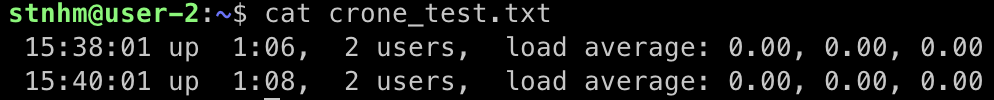

# Linux

## Part 1. Установка ОС

- Узнайте версию Ubuntu, выполнив команду `cat /etc/issue.`
- Вставьте скриншот с выводом команды.

## Part 2. Создание пользователя

- Создать пользователя, отличного от пользователя, который создавался при установке. Пользователь должен быть добавлен в группу `adm`

`sudo adduser user-2`
`sudo usermod -aG adm user-2`
`su user-2`

- Вставьте скриншот вызова команды для создания пользователя.

- Новый пользователь должен быть в выводе команды `cat /etc/passwd`
- Вставьте скриншот с выводом команды.

## Part 3. Настройка сети ОС

- Задать название машины вида user-1  

- 

- Установить временную зону, соответствующую вашему текущему местоположению  

`timedatectl`
`sudo timedatectl set-timezone Europe/Moscow`

- 

- Вывести названия сетевых интерфейсов с помощью консольной команды

`ip link show`

- В отчёте дать объяснение наличию интерфейса lo.  

- `lo` - интерфейс обратной петли и позволяет компьютеру обращатся к самому себе. Интерфейс имеет ip-адрес 127.0.0.1 и необходим для нормальной работы системы.

- Используя консольную команду получить ip адрес устройства, на котором вы работаете, от DHCP сервера

`hostname -I`

- В отчёте дать расшифровку DHCP.  

- `Dynamic Host Configuration Protocol (DHCP)` - это протокол управления сетью, используемый в сетях TCP/IP, в котором DHCP-сервер динамически присваивает каждому устройству IP-адрес и другие параметры сетевой конфигурации, чтобы они могли связываться с другими IP-сетями.

- Определить и вывести на экран внешний ip-адрес шлюза (ip) и внутренний IP-адрес шлюза, он же ip-адрес по умолчанию (gw)

  `ip route | grep default`
  `wget -qO- eth0.me`
  

- Задать статичные (заданные вручную, а не полученные от DHCP сервера) настройки ip, gw, dns (использовать публичный DNS серверы, например 1.1.1.1 или 8.8.8.8)  

  
  
  
  

- Перезагрузить виртуальную машину. Убедиться, что статичные сетевые настройки (ip, gw, dns) соответствуют заданным в предыдущем пункте  

`sudo reboot`

- В отчёте опишите, что сделали для выполнения всех семи пунктов (можно как текстом, так и скриншотами).
- Успешно пропинговать удаленные хосты 1.1.1.1 и ya.ru и вставить в отчёт скрин с выводом команды. В выводе команды должна быть фраза "0% packet loss".

## Part 4. Обновление ОС

- Обновить системные пакеты до последней на момент выполнения задания версии  

- `sudo apt-get update`

- `sudo apt-get upgrade`

- После обновления системных пакетов, если ввести команду обновления повторно, должно появится сообщение, что обновления отсутствуют.
- Вставить скриншот с этим сообщением в отчёт.

## Part 5. Использование команды **sudo**

- Разрешить пользователю, созданному в [Part 2](#part-2-создание-пользователя), выполнять команду sudo

`sudo touch /etc/sudoers.d/user2`
`sudo nano /etc/sudoers.d/user2`
typing `user2 ALL=(ALL:ALL) ALL`
`su user2`

- `sudo (substitute user and do, дословно «подменить пользователя и выполнить»)` — программа для системного администрирования UNIX-систем, позволяющая делегировать те или иные привилегированные ресурсы пользователям с ведением протокола работы.

- Поменять hostname ОС от имени пользователя, созданного в пункте [Part 2](#part-2-создание-пользователя) (используя sudo).
- Вставить скрин с изменённым hostname в отчёт.

## Part 6. Установка и настройка службы времени

- Настроить службу автоматической синхронизации времени  

`sudo apt install -y ntp`
`dpkg -l | grep "ntp"`
`sudo apt update`
`ntpq -p`
`sudo systemctl stop ntp`
`sudo ntpd -gq`
`sudo systemctl start ntp`
`sudo systemctl status ntp`
`sudo apt-get purge ntp`
`timedatectl`

- Вывести время, часового пояса, в котором вы сейчас находитесь.
- Вывод следующей команды должен содержать `NTPSynchronized=yes`: \
  `timedatectl show`
- Вставить скрины с корректным временем и выводом команды в отчёт.

## Part 7. Установка и использование текстовых редакторов

- Установить текстовые редакторы **VIM** (+ любые два по желанию **NANO**, **MCEDIT**, **JOE** и т.д.)  

- Используя каждый из трех выбранных редакторов, создайте файл *test_X.txt*, где X -- название редактора, в котором создан файл. Напишите в нём свой никнейм, закройте файл с сохранением изменений  

- В отчёт вставьте скриншоты:
  - Из каждого редактора с содержимым файла перед закрытием.
  
  
  
- В отчёте укажите, что сделали для выхода с сохранением изменений.

- `vim` : `:wq`

- `nano` : `^X, y`
- `joe` : `^K+X`

- Используя каждый из трех выбранных редакторов, откройте файл на редактирование, отредактируйте файл, заменив никнейм на строку "21 School 21", закройте файл без сохранения изменений

- В отчёт вставьте скриншоты:
  - Из каждого редактора с содержимым файла после редактирования.
  
  
  
  
- В отчёте укажите, что сделали для выхода без сохранения изменений.

- `vim` : `:q!`

- `nano` : `^X, n`
- `joe` : `^C, y`

- Используя каждый из трех выбранных редакторов, отредактируйте файл ещё раз (по аналогии с предыдущим пунктом), а затем освойте функции поиска по содержимому файла (слово) и замены слова на любое другое

- В отчёт вставьте скриншоты:
  - Из каждого редактора с результатами поиска слова.
  - Из каждого редактора с командами, введёнными для замены слова на другое.
  - `vim` : `:%s/h/Come!`
    
    
  - `nano` : `Ctrl + \`, `a`
    
    
    
  - `joe` : `Ctrl + K + F`, `r`, `y`
    
    
    
    
    

## Part 8. Установка и базовая настройка сервиса **SSHD**

- Установить службу SSHd  

  `sudo apt-get install openssh-server`

- Добавить автостарт службы при загрузке системы  

  `sudo systemctl enable ssh`

- Перенастроить службу SSHd на порт 2022  

  `vim /etc/ssh/sshd_config`
  `sudo systemctl restart sshd`
  

- Используя команду ps, показать наличие процесса sshd. Для этого к команде нужно подобрать ключи

  `ps -aux | grep ssh`
  

- В отчёте объяснить значение команды и каждого ключа в ней.
`ps` отображает информацию о выборе активного процессы. Команда `ps` выводит список текущих процессов на вашем сервере в виде таблицы, с которой можно удобно работать: сортировать, изменять количество колонок и прочие.
- Общий синтаксис:
  `$ ps опции`
  `$ ps опции | grep параметр`

- Опции:
  `-A, -e, (a)` - выбрать все процессы;
  `-a` - выбрать все процессы, кроме фоновых;
  `-d, (g)` - выбрать все процессы, даже фоновые, кроме процессов сессий;
  `-N` - выбрать все процессы кроме указанных;
  `-С` - выбирать процессы по имени команды;
  `-G` - выбрать процессы по ID группы;
  `-p, (p)` - выбрать процессы PID;
  `--ppid` - выбрать процессы по PID родительского процесса;
  `-s` - выбрать процессы по ID сессии;
  `-t, (t)` - выбрать процессы по tty;
  `-u, (U)` - выбрать процессы пользователя.

- Опции форматирования:

  `-с` - отображать информацию планировщика;
  `-f` - вывести максимум доступных данных, например, количество потоков;
  `-F` - аналогично `-f`, только выводит ещё больше данных;
  `-l` - длинный формат вывода;
  `-j, (j)` - вывести процессы в стиле Jobs, минимум информации;
  `-M, (Z)` - добавить информацию о безопасности;
  `-o, (o)` - позволяет определить свой формат вывода;
  `--sort, (k)` - выполнять сортировку по указанной колонке;
  `-L, (H)`- отображать потоки процессов в колонках LWP и NLWP;
  `-m, (m)` - вывести потоки после процесса;
  `-V, (V)` - вывести информацию о версии;
  `-H` - отображать дерево процессов;

- Перезагрузить систему

  `sudo reboot`

- Вывод команды `netstat -tan` должен содержать `tcp 0 0 0.0.0.0:2022 0.0.0.0:* LISTEN` (если команды netstat нет, то ее нужно установить)
  `sudo apt install net-stat`
  `netstat -tan`
- Скрин с выводом команды вставить в отчёт.
  

- В отчёте объяснить значение ключей -tan, значение каждого столбца вывода, значение 0.0.0.0.

  `netstat (network statistics)` — утилита командной строки, выводящая на дисплей состояние TCP-соединений (как входящих, так и исходящих), таблицы маршрутизации, число сетевых интерфейсов и сетевую статистику по протоколам.
  `-t` - Отображение текущего подключения в состоянии переноса нагрузки с процессора на сетевой адаптер при передаче данных.
  `-a` - Отображение всех подключений и ожидающих портов.
  `-n` - Отображение адресов и номеров портов в числовом формате.

**Output:**

- *Active Internet connections* (TCP, UDP, raw)
- *Proto*
  Протокол (tcp, udp, raw), используемый сокетом.
- *Recv-Q*
  Количество байтов, не скопированных пользовательской программой, подключенной к этому сокету.
- *Send-Q*
  Количество байтов, не подтвержденных удаленным хостом.
- *Local Address*
  Адрес и номер порта локального конца сокетаю
- *Foreign Address*
  Адрес и номер порта удаленного конца сокета. Аналогичен «Локальному адресу».
- *State*
  Состояние сокета. Поскольку в необработанном режиме нет состояний и обычно состояния не используются в UDP, этот столбец можно оставить пустым. Обычно это может быть одно из нескольких значений:

  `ESTABLISHED`
    Сокет имеет установленное соединение.
  `SYN_SENT`
    Сокет активно пытается установить соединение.
  `SYN_RECV`
    Из сети получен запрос на подключение.
  `FIN_WAIT1`
    Сокет закрывается, и соединение разрывается.
  `FIN_WAIT2`
    Соединение закрывается, и сокет ожидает завершения работы с удаленного конца.
  `TIME_WAIT`
    Сокет ожидает после закрытия, чтобы обработать пакеты, все еще находящиеся в сети.
  `CLOSED`
    Сокет не используется.
  `CLOSE_WAIT`
    Удаленный конец отключился, ожидая закрытия сокета.
  `LAST_ACK`
    Удаленный конец отключился, и сокет закрыт. Ожидание подтверждения.
  `LISTEN`
   Сокет прослушивает входящие соединения. Такие сокеты не включаются в вывод, если вы не укажете опцию --listening ( -l ) или --all ( -a ).
  `CLOSING`
    Оба сокета отключены, но мы все еще не отправили все наши данные.
  `UNKNOWN`
    Состояние сокета неизвестно.

  *IP-адрес 0.0.0.0* — это немаршрутизируемый адрес IPv4, который можно использовать в разных целях, в основном, в качестве адреса по умолчанию или адреса-заполнителя. Такой адрес указывает хост, который обращается к DHCP для получения IP адреса.

## Part 9. Установка и использование утилит **top**, **htop**

- Установить и запустить утилиты top и htop  

- По выводу команды top определить и написать в отчёте:
  - uptime - `up 40 min`
  - количество авторизованных пользователей - `1 user`
  - общую загрузку системы - `load average`
  - общее количество процессов - `Tasks: 96 total`
  - загрузку cpu - `%Cpu(s): 0.0`
  - загрузку памяти - `MiB Mem :  146.5 used`, `MiB Swap:  0.0 used`
  - pid процесса занимающего больше всего памяти - `646` (Shift + M)
    
  - pid процесса, занимающего больше всего процессорного времени - `1`
- В отчёт вставить скрин с выводом команды htop:
  - отсортированному по PID, PERCENT_CPU, PERCENT_MEM, TIME
`PID`:

`PERCENT_CPU`:

`PERCENT_MEM`:

`TIME`:

  - отфильтрованному для процесса sshd
    
  - с процессом syslog, найденным, используя поиск
    
  - с добавленным выводом hostname, clock и uptime  
    

## Part 10. Использование утилиты **fdisk**

- Запустить команду fdisk -l

- В отчёте написать название жесткого диска, его размер и количество секторов, а также размер swap.
  
  Название жёсткого диска: `sda`
  Размер жёсткого диска: `10Gib`
  Количество секторов: `20971520 sectors`
  Размер `swap`: 1.5G (`sudo swapon --show`)

## Part 11. Использование утилиты **df**

- Запустить команду df  

  

- В отчёте написать для корневого раздела (`/`):
  - размер раздела : `8408452`
  - размер занятого пространства : `4191204`
  - размер свободного пространства : `3768532`
  - процент использования : `53%`
- Определить и написать в отчёт единицу измерения в выводе. (`Kb`)

- Запустить команду df -Th

  

- В отчёте написать для корневого раздела (`/`):
  - размер раздела : `8.1G`
  - размер занятого пространства : `4.0G`
  - размер свободного пространства : `3.6G`
  - процент использования : `53%`
- Определить и написать в отчёт тип файловой системы для раздела. (`ext4`)

## Part 12. Использование утилиты **du**

- Запустить команду du

  

- Вывести размер папок /home, /var, /var/log (в байтах, в человекочитаемом виде)

  

- Вывести размер всего содержимого в /var/log (не общее, а каждого вложенного элемента, используя *)

  

- В отчёт вставить скрины с выводом всех использованных команд.

## Part 13. Установка и использование утилиты **ncdu**

- Установить утилиту ncdu

- Вывести размер папок /home, /var, /var/log

  `sudo ncdu /home`
  
  `sudo ncdu /var`
  
  `sudo ncdu /var/log`
  

- Размеры должны примерно совпадать с полученными в [Part 12](#part-12-использование-утилиты-du).

- В отчёт вставить скрины с выводом использованных команд.

## Part 14. Работа с системными журналами

- Открыть для просмотра

- 1. /var/log/dmesg

  `less /var/log/dmesg`

- 2. /var/log/syslog

  `less /var/log/syslog`

- 3. /var/log/auth.log  

  `less /var/log/auth.log`

- Написать в отчёте время последней успешной авторизации, имя пользователя и метод входа в систему.
  `sudo grep -ai LOGIN /var/log/auth.log`
  
- Перезапустить службу SSHd.
  `sudo systemctl restart sshd`
- Вставить в отчёт скрин с сообщением о рестарте службы (искать в логах).
  `sudo grep -a restart /var/log/auth.log`
  

## Part 15. Использование планировщика заданий **CRON**

- Используя планировщик заданий, запустите команду uptime через каждые 2 минуты

  `crontab -e`
    

- Найти в системных журналах строчки (минимум две в заданном временном диапазоне) о выполнении.
- Вывести на экран список текущих заданий для CRON.
- Вставить в отчёт скрины со строчками о выполнении и списком текущих задач.
  `cat crone_test.txt`
    
  `sudo grep CRON /var/log/syslog > cron_data.txt`
  `cat cron_data.txt`
    

- Удалите все задания из планировщика заданий

- В отчёт вставьте скрин со списком текущих заданий для CRON.
  `crontab -e`
    
